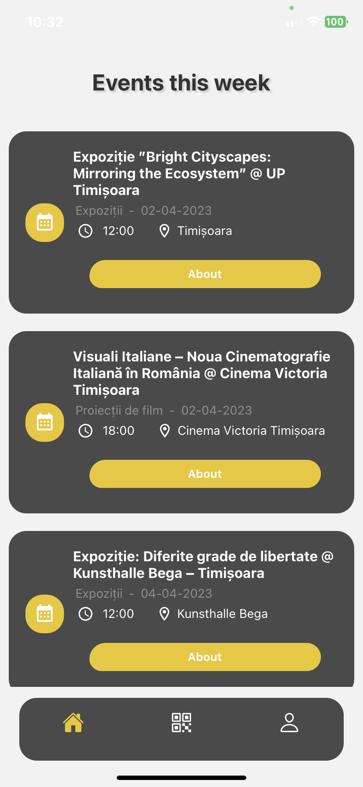
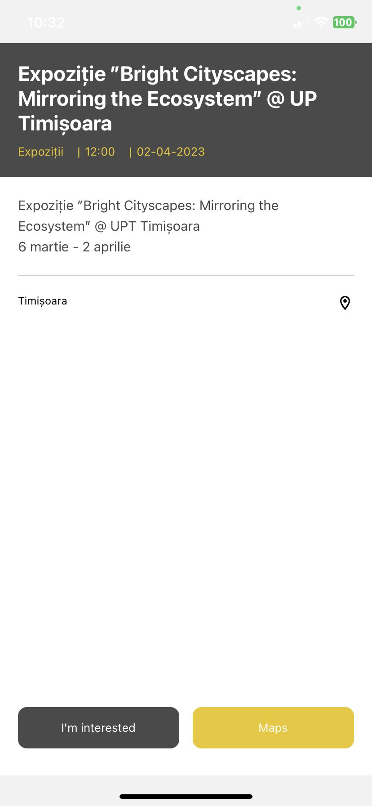
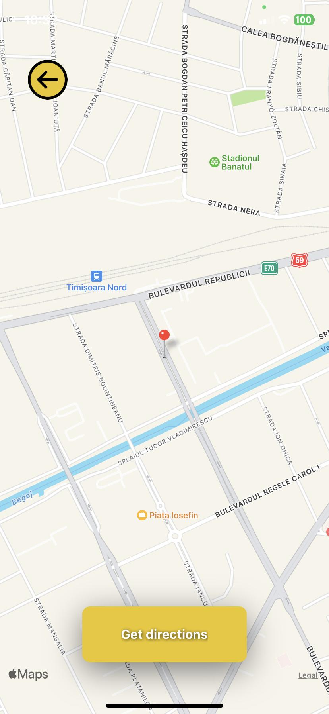
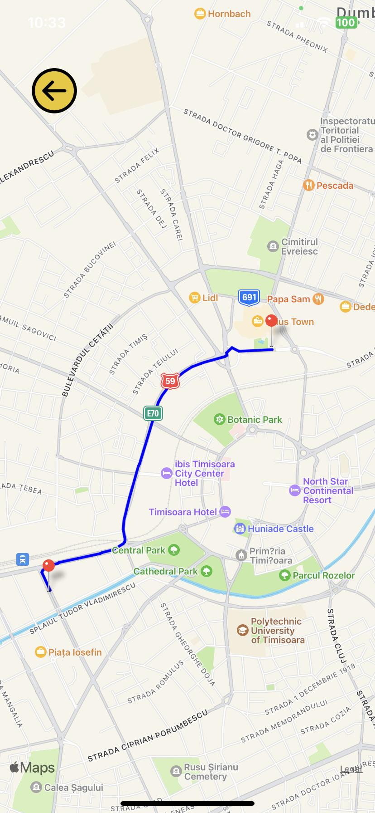
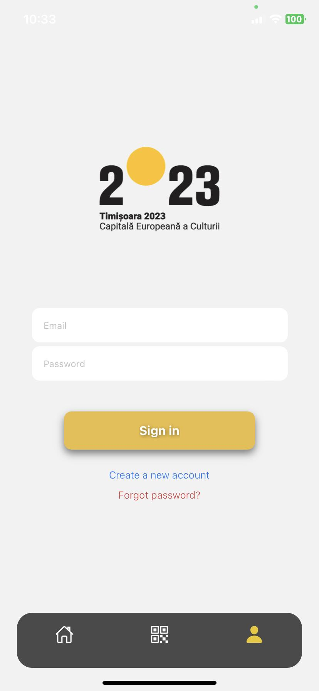
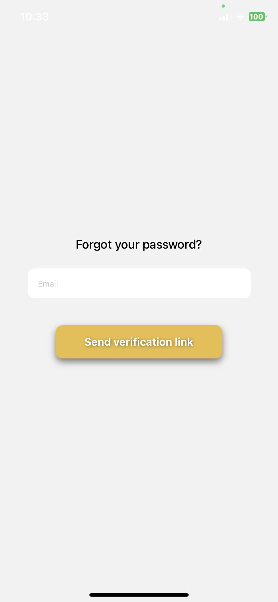
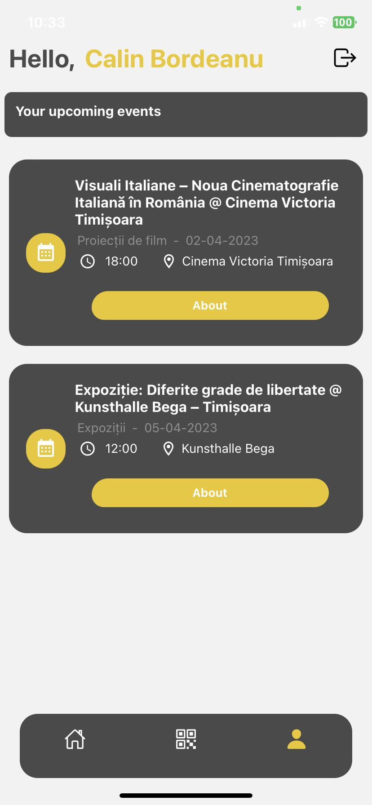

# TimisoaraEvents

TimisoaraEvents is a mobile application built with React Native Expo, JavaScript, and Firebase as the backend. The purpose of the app is to help people find upcoming events in Timisoara, which is the European Capital of Culture of 2023. The app was created for the iTEC Hackathon in Timisoara, specifically for the Mobile Development section.

# Getting Started

To get started with the iTec Event Finder, you will need to have the Expo CLI installed. You can install it using the following command:

```bash
npm install -g expo-cli
```
Once you have the Expo CLI installed, you can clone this repository and install the required dependencies using the following commands:
```bash
git clone https://github.com/sebibitica/itec.git
cd itec
npm install
```

To run the app, use the following command:
```bash
npm start
```

Now you can install ExpoClient on your phone or emulator and run the app

# Features
- View a list that displays the upcoming events for the next 7 days
- View event details, including date, time, location and description
- You can open the map to see where the event is and request directions
- Integrated QR code scanning: scan custom made QR codes for different events and they will take you to the event page inside the app
- Create your profile and save events that you're interested in

# Technologies used
- [React Native Expo](https://expo.dev/)
- JavaScript - used to build the front-end
- [Firebase](https://firebase.google.com/) - a cloud-based platform for building web and mobile apps

# Creators
- Sebastian Bitica
- Calin Bordeanu
- Tudor Todea

<div>



</div>

<div>



</div>

<div>


</div>
